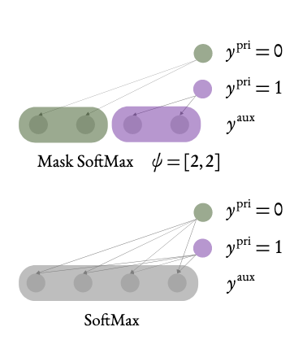
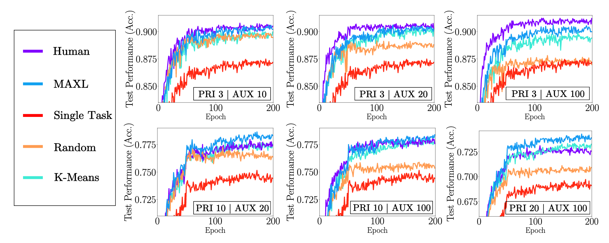
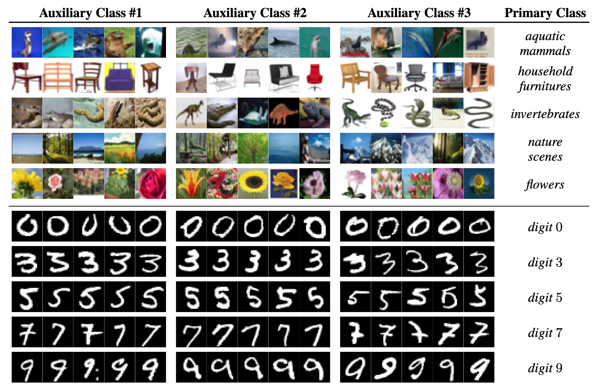

通常在訓練的時候，如果能有一些輔助的任務(task)，通常會對主要的任務在效能上有所提升，然而這些輔助任務的答案通常會需要人類來標注，並不能隨意的想加輔助任務就加輔助任務，而這篇文章要介紹的NeurIPS 2019的[Self-Supervised Generalisation with Meta Auxiliary Learning](https://papers.nips.cc/paper/8445-self-supervised-generalisation-with-meta-auxiliary-learning.pdf)，將輔助任務的答案都用機器來產生，免去了準備輔助任務答案的麻煩。
<!--more-->

## 簡介
在先前的研究當中，大多表示如果可以讓model能夠同時有多個任務可以學習，並且共用部分參數的話，對於整體學習的成果會有所提升。

舉個例子來說，如果今天想要做一個影像辨識的模型，輸入是一張動物的圖片，輸出是該動物的種類，像是貓、狗、鳥等等，我們可以直接疊一些CNN，把圖片丟進去，輸出就直接是動物的種類，gradient descent硬做一波，然而如果我們有更多的資訊，像是知道貓是屬於貓科、狗是屬於犬科，我們可以在model的中間或是在最後額外拉出一條flow來去判別這個動物的科別，通常後者在判斷動物種類的效果應該會比較好，因為在前面CNN的部分更可以知道哪些資訊是需要被保留的。

不過這樣子的方式其實是很需要人類幫助的，我們需要知道判斷動物種類可以參考科別，而且我們也需要對每一張圖片除了標注種類，還要額外標注科別，答案的獲取相當的昂貴，為此，這篇paper希望能夠讓機器來取代人類，自動產生出一些有意義的輔助答案來幫助主要的任務能學得更好，而上方的圖是這篇paper的示意圖。

## 方法
### Model架構圖

這篇paper將他們所創造出來的model稱之為Meta AuXiliary Learning (MAXL)，由兩個model所組成，分別是在圖片上半部的*Multi-task Network*和下半部的*Label-Generation Network*。

### Multi-task Network

Multi-task Network就是我們主要的neural network，其參數為$$\theta_1$$，輸入$$x$$，輸出primary task和auxiliary task的答案$$f_{\theta_1}^{pri}(x)$$和$$f_{\theta_1}^{aux}(x)$$，其中auxiliary task的答案$$y^{aux}$$是由底下的Label-Generation Network所預測出來的。

而這個network的目標是希望能夠分對primary task以及auxiliary task，所以它的objective function為

$$\arg\limits_{\theta_1}\min\left( \mathcal{L}\left( f_{\theta_1}^{pri}(x_{(i)}), y_{(i)}^{pri} \right) + \mathcal{L} \left( f_{\theta_1}^{aux}(x_{(i)}), y_{(i)}^{aux} \right) \right)$$

$$Focal\ loss : \mathcal{L}(\hat y, y)=-y(1-\hat y)^\gamma\log(\hat y)$$

其中所使用的loss function為focal loss，在paper裡說可以幫助model更專注在錯誤的predict上。

### Label-Generation Network

Label-Generation Network的目的是希望能夠產生出讓Multi-task Network可以學得更好的label，所以它的objective function被設定為

$$\arg\limits_{\theta_2}\min\mathcal{L}\left( f_{\theta_1^+}^{pri}(x_{(i)}),y_{(i)}^{pri} \right)$$

$$\theta_1^+=\theta_1-\alpha\bigtriangledown_{\theta_1}\left( \mathcal{L} \left( f_{\theta_1}^{pri}(x_{(i)}), y_{(i)}^{pri} \right) + \mathcal{L} \left( f_{\theta_1}^{aux}(x_{(i)}), y_{(i)}^{aux} \right) \right)$$

此objective function的含義是，在Multi-task Network經過一次更新以後，希望它在primary task上的loss可以最小，這個概念有點類似[MAML](https://arxiv.org/pdf/1703.03400.pdf)中，希望找到一個初始參數，讓model在更新過後可以在各個task上的綜合表現最佳。

然而經過他們的實驗發現，用上方的objective function來訓練的話，Label-Generation Network常常會輸出同樣的label，所以在實際上更新的時候會再多加一個regularization loss如下

$$\theta_2=\theta_2-\beta\bigtriangledown_{\theta_2}\left( \mathcal{L}\left( f_{\theta_1^+}^{pri}(x_{(i)}), y_{(i)}^{pri} \right) + \lambda \mathcal{H}(y_{(i)}^{aux})\right)$$

$$\mathcal{H}(\hat y_{(i)})=\sum\limits_{k=1}\limits^{K}\hat y_{(i)}^k\log \hat y_{(i)}^k,\ \ \hat y_{(i)}^k=\frac{1}{N}\sum\limits_{n=1}\limits^{N}\hat y_{(i)}^k[n]$$

此regularization loss的意思是，希望在每個batch所產生出來的每個label，它的entropy可以越大越好。

在一開始讀到這邊的時候，我有一個沒有想通的地方是，從$$\theta_2$$更新的式子(5)裡面來看，只有後面regularization的那項跟$$\theta_2$$有關，微分中的第一項好像看不出來跟$$\theta_2$$有關係，後來探究了一下，發現應該要把第一項展開才能看得出來它跟$$\theta_2$$的關係，在式(4)中微分裡面的第二項裡的$$y_{(i)}^{aux}$$是由Label-Generation Network產生的，所以式(4)更精確的寫法是

$$\theta_1^+=\theta_1-\alpha\bigtriangledown_{\theta_1}\left( \mathcal{L} \left( f_{\theta_1}^{pri}(x_{(i)}), y_{(i)}^{pri} \right) + \mathcal{L} \left( f_{\theta_1}^{aux}(x_{(i)}), f_{\theta_2}(x_{(i)}) \right) \right)$$

式(5)就可以改寫成

$$\theta_2=\theta_2-\beta\bigtriangledown_{\theta_2}\left( \mathcal{L}\left( f_{\theta_1-\alpha\bigtriangledown_{\theta_1}\left( \mathcal{L} \left( f_{\theta_1}^{pri}(x_{(i)}), y_{(i)}^{pri} \right) + \mathcal{L} \left( f_{\theta_1}^{aux}(x_{(i)}), f_{\theta_2}(x_{(i)}) \right) \right)}^{pri}(x_{(i)}), y_{(i)}^{pri} \right) + \lambda \mathcal{H}(y_{(i)}^{aux})\right)$$

這時就可以看出來第一項其實也是跟$$\theta_2$$有關，只是是二次微分，一個Hessian matrix，好在大多機器學習的工具像是tensorflow和pytorch都有支援Hessian matrix的計算，所以在程式碼裡面只需要寫成式(5)那樣就可以算微分了，可以看[paper的原始碼](https://github.com/lorenmt/maxl/blob/master/model_vgg_maxl.py#L402)。

#### Mask Softmax

在paper裡面有另外提到說，他們覺得在訓練每個不同primary task的類別時，應該給予不一樣的auxiliary label，像是在訓練$$y^{pri}=0$$這個類別的時候，所給予的auxiliary label應該就只專門拿來用在$$y^{pri}=0$$的情況上，不應該在不同的$$y^{pri}$$都給同樣的auxiliary label，所以在Label-Generation Network有一個$$\psi$$，代表的是對於每個不同的$$y^{pri}$$，要給予多少個auxiliary class，如果$$\psi=[2, 2]$$的話，就代表給$$y^{pri}=0$$兩個auxiliary class，也給$$y^{pri}=1$$兩個auxiliary class。

### MAXL Algorithm

下圖為這篇paper附上的algorithm。

簡單來說就是先訓練一下Multi-task Network，接著固定Multi-task Network的參數，抽樣一些訓練資料，算出經過一次更新以後的$$\theta_1^+$$，再更新Label-Generation Network。

## 實驗

### 與只有Primary Task做比較

這邊是用圖形辨識來驗應，Backbone是Multi-task Network的model架構，可以看到MAXL在各個dataset上面都比只用primary task訓練還要來得好，但也只有好一點點。

### 與其他Label Generation方法比較

上面比較對象中的K-Means指的是對輸入$$x$$做一個Autoencoder，對中間的latent representation做K-Means，以輸入$$x$$屬於哪一個群組來當作label。可以看到MAXL在各個參數的表現上都有不錯的成績，與human在伯仲之間。

### 對model的幫助

這邊作者想要知道說，Label-Generation Network所產出的label究竟對model而言有沒有用處，而判斷有沒有用處的依據是去看model對training data上的gradient與對產生出的label的gradient的相似程度。假設training data會帶領model往好的方向邁進，如果產生出的label與training data的gradient相近的話，我們就相信產生出的label是有幫助的。

$$ Similarity = -1 \rightarrow\ 沒有幫助，甚至在扯後腿\\Similarity=0 \rightarrow\ 對model沒什麼影響\\Similarity=1 \rightarrow\ 對model的學習有正向的幫助$$

可以看到MAXL的產生出的label與training data的gradient的相似度都介在0~1之間，而且並不像其他方法，隨著訓練過程的推進而相似度下降，代表MAXL有一直在幫助model學習。

### 究竟Label-Generation Network學到了什麼

這邊作者想看MAXL產生出來的label究竟是有什麼樣的含義，結論就是其實看不太出來，因為產生出來的label是要給機器看的，人類看不出來也是蠻合理的。

## 結論

這篇paper提出了MAXL，在不需要專業知識以及額外訓練資料的情況下，可以稍微提升model在分類上的準確率，作者表示希望未來可以套用到regression相關的任務上。