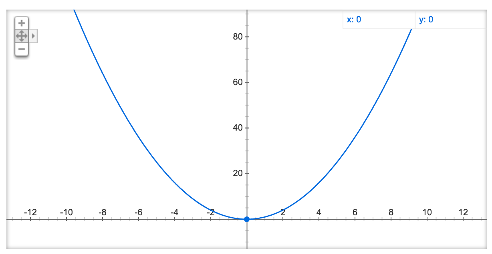

稍微講一下Machine Learning當中經常被使用的gradient descent的概念以及調整learning rate的方法。

<!--more-->

## Gradient Descent的概念

在各種Machine Learning的paper當中，常可以看到作者們都說他們是用gradient descent來找到model的參數，那gradient descent是什麼呢？

假如我們今天的loss function是一個二次函數$$\mathcal{L}(x)=x^2$$，其中$$x$$可以想作是model的參數，而我們的目標是希望找到一個$$x$$可以讓loss function可以最小。

在訓練一開始的時候，我們會隨機產生model的參數，假設我們這次產生的參數為6，也就是$$x=6$$，這時所得到的loss為$$\mathcal{L}(6)=36$$，我們希望能調整一下參數$$x$$來讓loss下降一些，而使用的方法便是對loss function做微分，來得到目前在這個位置($$x=6$$)，loss function的趨勢是往哪邊走。

對loss function微分並帶入現在的位置我們可以得到

$$\mathcal{L}'(x)=2x,\ \mathcal{L}'(6)=12$$

意思是在$$x=6$$的趨勢(斜率)是正的，當$$x$$增加的話，loss function的值也會隨之增加，反之便會減少，所以我們會將$$x$$去減掉其斜率來去尋找最小值，這時通常會再乘上一個人工設定的參數(learning rate) $$\alpha$$，以避免一次更新參數的幅度過大，就變成了常見的gradient descent的公式

$$x\leftarrow x-\alpha\bigtriangledown_x\mathcal{L}(x)$$

假設我們這邊設定$$\alpha=0.6$$，那經過一次更新以後，我們的參數就會變成$$x=6-0.6*12=-1.2$$，再經過一次以後，參數會變成$$x=-1.2-0.6*(-2.4)=0.24$$，隨著不斷的更新，參數也會越來越接近會讓loss function最小的$$x=0$$。

值得一提的是，這個人工設定的參數$$\alpha$$其實是很重要的，有可能會決定這個model會不會收斂，舉例來說，假設現在$$x=3$$且$$\alpha=1$$，經過一次更新以後會得到$$x=3-1*6=-3$$，再次更新會得到$$x=-3-1*(-6)=3$$，使得參數不斷地在$$3$$和$$-3$$之間震盪，不會收斂到最小值0，所以底下將會介紹一些方法來適時的調整learning rate，讓model比較有機會可以收斂到最小值。

## Learning Rate的調整

底下的$$\theta$$代表model的參數、$$\alpha$$為learning rate、$$\bigtriangledown_\theta$$是對model參數作微分、$$\mathcal{L}_\theta(x)$$是指在model參數為$$\theta$$的情況下，對model輸入$$x$$，loss function算出來的值。

### Stochastic Gradient Descent

最一般的gradient descent，learning rate為人工設定的固定常數。

$$\theta\leftarrow\theta-\alpha \bigtriangledown_\theta \mathcal{L}_\theta(x)$$

而之所以加上**Stochastic**的關係是因為，在每次更新的時候是使用小批次(mini-batch)的方式，所以多了一些隨機的成份在裡面。

### Momentum

Momentum的概念是保留前面所算出來的gradient，像是一個小球滾下山坡，並不會到一個凹槽就停住，會有從山坡上滾下所帶來的動能，而Stochastic Gradient Descent所算出來的gradient只與目前當下的參數有關，相比之下較容易卡進local minimum。

$$v_t=\gamma v_{t-1}+\alpha\bigtriangledown_\theta\mathcal{L}_\theta(x)\\ \theta\leftarrow\theta-v_t$$

這邊的$$v_{t-1}$$可以想成是前面gradient的累積，而$$\gamma$$是一個參數，通常會設成$$0.9$$，讓動能(之前gradient的影響)隨著時間遞減。

### Nesterov Accelerated Gradient (NAG)

概念與Momentum相似，只是多預測了一步，來達到抄捷徑的效果。

$$v_t=\gamma v_{t-1}+\alpha\bigtriangledown_\theta\mathcal{L}_{\theta-\gamma v_{t-1}}(x)\\ \theta\leftarrow\theta-v_t$$

根據先前的gradient $$v_{t-1}$$，我們可以預期model的參數$$\theta$$應該會跑到$$\theta-\gamma v_{t-1}$$附近的地方，而在$$\theta-\gamma v_{t-1}$$會算出新的gradient，所以我們的目標應該直接設在**"$$\theta-\gamma v_{t-1}$$之後要去的位置"**，來加速訓練的速度。

### Adagrad

在前面的Momentum和Nesterov Accelerated Gradient都是設好固定的learning rate，然而在訓練的過程當中通常會希望剛開始訓練時的learning rate較大，到後面調降learning rate的來找到極值，而Adagrad就是想要去動態的調整learning rate，其中的Ada是指Adaptive的意思。

$$\theta\leftarrow\theta-\frac{\alpha}{\sqrt{G_t+\epsilon}}\bigtriangledown_\theta\mathcal{L}_\theta(x)$$

上面的$$G_t$$指的是從第一次update到現在所有gradient的平方和，而$$\epsilon$$是避免除以0而加的一個常數，可以從式子看出來，剛開始的時候，累積的gradient很少，所以learning rate較大，而後gradient慢慢累積，learning rate就會減小了。

### Adadelta

雖說Adagrad可以動態的調整learning rate，但是其調整的方式只能不斷的減小，沒辦法在所有訓練的狀況下都有好的結果，而Adadelta就是想要來解決learning rate只能縮小的問題。

在Adadelta的算法裡，它並不會把所有過去到現在的gradient都拿進來算平方和，而是用sliding window的方式取$$w$$個，並且在算平均時，是像Momentum那樣，使用decaying average

$$E[g^2]_t=\gamma E[g^2]_{t-1}+(1-\gamma)g_t^2\\ \theta\leftarrow\theta-\frac{\alpha}{\sqrt{E[g^2]_t+\epsilon}}g_t$$

$$E[g^2]_t$$指的是到時間$$t$$為止的gradient平方和，而$$g_t$$是目前這個時間點$$t$$的gradient，接著作者又稍微延伸了一下，試著不要設定learning rate $$\alpha$$。

$$\triangle \theta_t=-\frac{RMS[\triangle\theta]_{t-1}}{RMS[g]_t}g_t\\ \theta_{t+1}=\theta_t+\triangle\theta_t$$

$$RMS$$是root, mean, square，也就是平方相加開根號，這個式子的概念可以想成，我這次的update幅度跟之前幾次的update幅度的平均的比值來當作learning rate。

### RMSprop

RMSprop好像是同時期與Adadelta發展出來的，概念與Adadelta類似，可以說是Adadelta的一個特例。

$$\theta_{t+1}=\theta_t-\frac{\alpha}{\sqrt{E[g^2]_t+\epsilon}}g_t$$

### Adaptive Moment Estimation (Adam)

前面所介紹的Momentum會在計算參數更新時，考慮前一次更新的方向，而RMSprop會根據gradient的大小對learning rate進行調整，這邊的Adam則是兩者的集大成，將兩個東西合併在一起。

$$m_t=\beta_1m_{t-1}+(1-\beta_1)g_t\\ v_t=\beta_2v_{t-1}+(1-\beta_2)g_t^2$$

$$m_t$$為Momentum的部分，$$v_t$$為RMSprop的部分，而作者發現當$$\beta_1$$和$$\beta_2$$接近1的時候會有一些bias，所以有稍微修正一些

$$\hat m_t=\frac{m_t}{1-\beta_1^t}\\ \hat v_t=\frac{v_t}{1-\beta_2^t}$$

實際上更新的式子如下

$$\theta_{t+1}=\theta_t-\frac{\alpha}{\sqrt{\hat v_t}+\epsilon}\hat m_t$$

### Adamax

在前面Adam裡面，調整learning rate的時候是使用$$\mathcal{l}_2-norm$$，而Adam的作者發現$$\mathcal{l}_{\infty}-norm$$也蠻好用的，所以嘗試放在更新的式子中

$$u_t=\beta_2^\infty v_{t-1}+(1-\beta_2^\infty)\vert g_t\vert^\infty=\max(\beta_2\cdot v_{t-1},\vert g_t\vert)\\ \theta_{t+1}=\theta_t-\frac{\alpha}{u_t}\hat m_t$$

### Nadam

Adam原先所使用的Mometum為最原始版本的，而Nadam便是使用NAG版本的Momentum，詳細的推倒和公式可以看考資料中的第二個連結。

## 參考資料

1. [機器/深度學習-基礎數學(三):梯度最佳解相關算法(gradient descent optimization algorithms)](https://medium.com/@chih.sheng.huang821/%E6%A9%9F%E5%99%A8%E5%AD%B8%E7%BF%92-%E5%9F%BA%E7%A4%8E%E6%95%B8%E5%AD%B8-%E4%B8%89-%E6%A2%AF%E5%BA%A6%E6%9C%80%E4%BD%B3%E8%A7%A3%E7%9B%B8%E9%97%9C%E7%AE%97%E6%B3%95-gradient-descent-optimization-algorithms-b61ed1478bd7)
2. [An overview of gradient descent optimization algorithms](https://ruder.io/optimizing-gradient-descent/index.html)