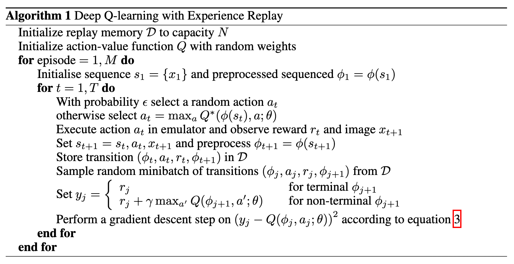

在之前的文章有提到Q-Networks，但卻沒有細講它的運作方式，這篇來介紹一下這曾經上過Nature的paper。

<!--more-->

## 簡介

在[這篇paper](https://www.cs.toronto.edu/~vmnih/docs/dqn.pdf)當中，作者利用Deep Reinforcement Learning的方法，讓機器學會打Atari小遊戲，並成功打破人類的紀錄，立下了RL的里程碑。

## 方法

### 背景介紹

在進入到方法之前，先介紹一下基本的設定以及Value function和Q function，在底下model訓練的時候會被用到。

#### 基本設定

在遊戲中我們可以說遊戲本身是一個環境$$\mathcal{E}$$，而玩家這個角色可以稱之為actor，玩家們所能觀測到的遊戲畫面稱之為state，而角色所能夠採取的動作，像是上下左右移動、射擊等等，稱之為action。

當我們現在觀測到遊戲畫面$$s_t$$，我們可以採取一個動作$$a_t$$，將$$(s_t,a_t)$$傳送給環境$$\mathcal{E}$$後會得到新的遊戲畫面$$s_{t+1}$$以及該動作的reward $$r_t$$，這邊的reward可以想成是遊戲分數上升了多少。

#### Value Function

Value function做的事情是去判斷以現在的policy $$\pi$$，處在現在這個state $$s_t$$最終的cumulated reward期望值會是多少，policy可以想做是這個玩家的思維或是操作，如果是某個玩家在現在的處境下，所能得到最終分數會是多少的感覺，寫作$$V^\pi(s)$$。

而value function的求法主要有兩種，分別是Monte-Carlo (MC)和Temporal-Difference (TD)。MC的方式就是讓玩家繼續玩到最後，並記錄他最終的cumulated reward，回頭再統計一下每個state的cumulated reward，假如說玩家$$\pi$$，在第一次遊玩的過程中，經過了state $$s$$，最終得到的遊戲分數是$$G_a$$，第二次遊玩也同樣經過了state $$s$$，但得到的遊戲分數是$$G_b$$，那麼state $$s$$的value function便可寫作$$V^\pi(s)=(G_a+G_b)/2$$。而TD的作法為$$V^\pi(s_{t+1})=V^\pi(s_t)+r_t$$，概念是我現在這個state $$s_t$$的value function所算出來的值，跟我下一個state $$s_{t+1}$$的值，應該只差了一個reward $$r_t$$而已。

MC和TD各有各的缺點，像是MC的缺點是它的variance比較大，每次遊戲在遊玩的時候會有一些隨機性存在，使得state在統計它的cumulated reward時variance不小，而TD雖然一次只看一步的reward，但它需要擔心的是value function估不準的問題。

#### Q-Function

Q-function和value function做的事情很像，但這邊Q-function還多考慮了採取的動作，也就是以現在的policy $$\pi$$，處在state $$s_t$$，採取action $$a_t$$，所能得到的cumulated reward期望值是多少，寫作$$Q^\pi(s, a)$$。

### Deep Q-Network

這邊DQN想要做的事情，便是去尋找Q function，在看到一個遊戲畫面$$s$$的時候，去選擇$$Q^\pi(s, a)$$最大的action $$a$$，來當作是policy $$\pi$$，而$$Q^\pi(s,a)$$的算法是使用TD的算法。

$$Q^*(s,a)=\mathbb{E}_{s'\sim\mathcal{E}}\left[r+\gamma\max\limits_{a'}Q^*(s',a')\vert s,a\right]$$

這邊的$$s'$$、$$a'$$代表的是下一個時間點的state和action，底下是整個DQN的algorithm。

#### $$\epsilon$$-greedy

在演算法當中可以看到，在第二個迴圈一開始，會以$$\epsilon$$的機率去隨機選擇一個動作$$a_t$$，目的是為了要去探索環境中的各種可能性，假如我們每次都選$$a_t=\max\limits_{a} Q(s, a)$$的話，很容易會讓model做出同樣的選擇，有可能有一些可以拿高分的可能性就被忽略了。

#### Experience Replay

在演算法的一開始有一個replay memory $$\mathcal{D}$$，其大小為$$N$$，這個memory的目的是去紀錄與環境互動的結果，可以看到在第二個迴圈裡，會把$$(\phi_t, a_t, r_t, \phi_{t+1})$$，放進memory $$\mathcal{D}$$中，而在訓練的時候會從memory裡面sample一個batch來做訓練。

#### Target Network

在式(1)和上面的演算法中，我們可以看到，這個DQN的目標是能夠精確的預估出$$r+\gamma\max\limits_{a'} Q(s', a';\theta)$$，但這個目標裡面又包含了自己這個network的output，這樣在訓練起來是比較不穩定的，為此，在實作上通常會用另一個network $$Q'$$來放進objective function，亦即model要去預估的是$$r+\gamma\max\limits_{a'}Q'(s',a';\theta)$$，這個network $$Q'$$其實就是前幾步的model $$Q$$，更具體的說，當$$Q$$以$$Q'$$為目標訓練一陣子以後，會複製一份$$Q$$的參數當作$$Q'$$的參數，並將之固定以後，繼續訓練$$Q$$的參數。

## 實驗

在表中可以看到，DQN在一些遊戲上超過了人類可以達到的分數。

## 結論

在這篇paper當中，作者提出了DQN，用deep learning的方式來去找Q function，並最終成功超越人類的表現。