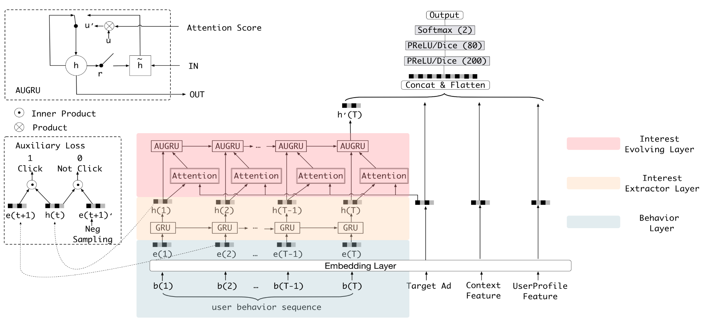

簡單記錄一下，看完此篇paper的筆記。

<!--more-->

[這篇paper](https://arxiv.org/pdf/1809.03672.pdf)是由阿里巴巴提出來，利用使用者的行為和基本資訊，來去預測使用者對廣告的CTR，榮獲AAAI 2019 accepted paper。

## DIEN

在這篇paper當中，作者將他們的model稱之為DIEN（Deep Interest Evolution Network），其架構如下圖。

可以看到在架構圖中右下方的地方，有三個輸入，分別是

* **Target Ad**：被預測的廣告embedding
* **Context Feature**：這個feature我沒有看得很懂，從paper的原文裡面說是時間以及其他的東西
* **UserProfile Feature**：使用者的embedding，包含性別、年齡等

左方的`b(1)、b(2)、b(T-1)、b(T)`是使用者行為，像是使用者點過什麼廣告，經過`Embedding Layer`以後稱之為**behavior feature**，之後這些feature會被餵到[Interest Extractor Layer](#interest-extractor-layer)和[Interest Evolving Layer](#interest-evolving-layer)，最終產生一個embeeding $$h'(T)$$。

最後$$h'(T)$$會與右方的**Target Ad**、**Context Feature**和**UserProfile Feature**一同串起來，經過一些fully connected layers以後，產生出2維的輸出（點、不點），並利用binary cross entropy來當作loss function。

$$ L_{target}=-\frac{1}{N}\sum\limits^{N}\limits_{(\textbf{x},y)\in\mathcal{D}}(y\log p(\textbf{x})+(1-y)\log (1-p(\textbf{x})))$$

### Interest Extractor Layer

在Interest Extractor Layer裡面會去將使用者行為透過GRU製作成feature，在這邊作者使用的是使用者廣告的點擊來當作使用者行為，也就是照著時間順序將使用者點擊的廣告的embedding餵入GRU中，值得一提的是，作者將GRU的輸出額外拉出來做auxiliary loss，來幫助GRU訓練得更好。

#### Auxiliary Loss

在每一個時間點$$t$$，GRU會產生一個輸出$$h(t)$$，這時會將使用者下一個時間點$$t+1$$點擊的廣告embedding $$e(t+1)$$拿出來，接著從眾多廣告embedding中隨機取樣一個沒有點擊的出來作為$$e(t+1)\prime$$，並將有點擊的label成$$1$$，沒點擊的label成$$0$$來做訓練，藉此來讓$$h(t)$$更能含有可以預測出下一個點擊的資訊。

```mermaid
graph LR;
    gru("h(t)")
    sig1["Sigmoid"]
    sig2["Sigmoid"]
    pos("e(t+1)")
    neg("e(t+1)'")
    label1((1))
    label0((0))
    pos-->sig1;
    gru-->sig1;
    sig1-->label1;
    gru-->sig2;
    sig2-->label0;
    neg-->sig2;
```

整體的loss fcuntion因此會變成

$$L=L_{target}+\alpha*L_{aux}$$

$$L_{aux}=-\frac{1}{N}\left( \sum\limits_{i=1}\limits^{N} \sum\limits_{t}\log\sigma(\textbf{h}^i_t,\textbf{e}^i_b[t+1])+\log(1-\sigma(\textbf{h}^i_t,\hat{\textbf{e}^i_b}[t+1]))\right )$$

### Interest Evolving Layer

使用者可能同時間表現出多種興趣，而我們比較想要知道的是使用者對某特定廣告的興趣有多少，所以在這邊作者加了Interest Evolving Layer，亦即另一層GRU，來去從使用者行為當中萃取出相對應廣告的興趣。

作者使用的方式是利用attention的機制，透過目標廣告的embedding與Interest Extractor Layer出來的embeeding做相似度的計算

$$a_t=\frac{\exp(\textbf{h}_tW\textbf{e}_a)}{\sum\limits_{j=1}\limits^{T}\exp(\textbf{h}_jW\textbf{e}_a)}$$

並利用各種不同的方式將這個attention weight融入至GRU中。

#### GRU with attentional input (AIGRU)

第一種方式是直接將Interest Extractor Layer的輸出$$\textbf{h}_t$$直接乘上attention weight $$a_t$$，然後輸入至Interest Evolving Layer中。

$$\textbf{i}'_t=\textbf{h}_t*a_t$$

#### Attention based GRU (AGRU)

第二種方式是透過算出來的attention weight來決定Interest Evolving Layer中hidden state $$\textbf{h}'_t$$要被更新多少。

$$\textbf{h}'_t=(1-a_t)*\textbf{h}'_{t-1}+a_t*\tilde{\textbf{h}'_t}$$

其中$$\textbf{h}'_{t-1}$$是前一個時間點，Interest Evolving Layer的輸出，而$$\tilde{\textbf{h}'_t}$$是當下這個時間點$$t$$，GRU內部所計算出來的hidden state，可以參照原先GRU的更新算式，或是[paper當中的式(2)~式(5)](https://arxiv.org/pdf/1809.03672.pdf)。

#### GRU with attentional update gate (AUGRU)

第三種方式是將update gate的值與attention weight相乘，直接控制update gate，這個方式也是實驗當中表現最好的方式。

$$\tilde{\textbf{u}}'_t=a_t*\textbf{u}'_t$$

$$\textbf{h}'_t=(1-\tilde{\textbf{u}}'_t)\circ\textbf{h}'_{t-1}+\tilde{\textbf{u}}'_t\circ\tilde{\textbf{h}}'_t$$

## Experiments

將DIEN套用在[Amazon Dataset](https://arxiv.org/pdf/1809.03672.pdf#cite.mcauley2015image)上面可以看到，DIEN的AUC是裡面最佳的，而作者有將這個model套用在企業的資料上，也獲得了不俗的成績。

在paper裡面實驗的章節中作者做了許多的實驗來去驗證model裡面的每一個環節都是有必要的，有興趣的人可以去看看原本的paper。

## 結論

在這篇paper裡面，作者提出了有點類似wide and deep架構的模型來去解CTR prediction的問題，也加入了各式各樣的方式來應用attention weight，只不過在實驗當中只有展示Electronics和Books這兩個類別的成效，如果可以加入不同類別的比較我覺得可以讓讀者了解model適合套用在哪種類別的場景當中會更好。