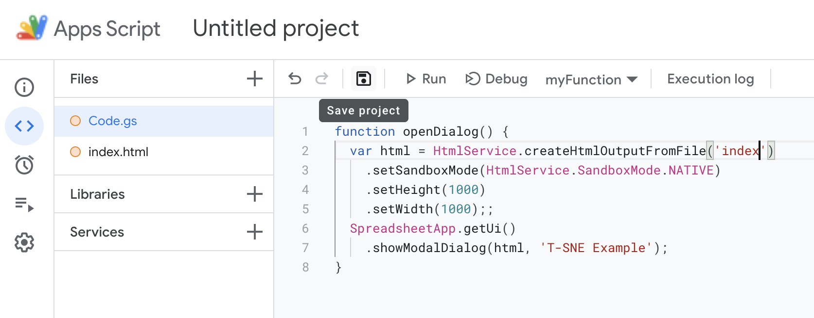
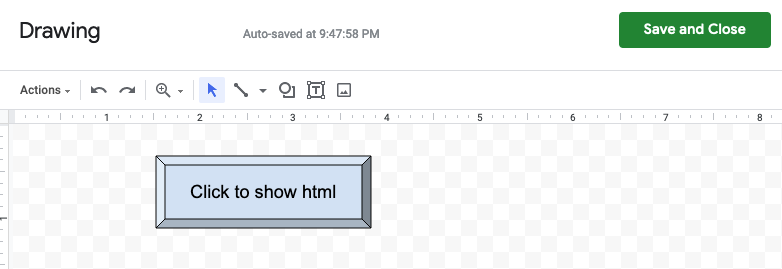
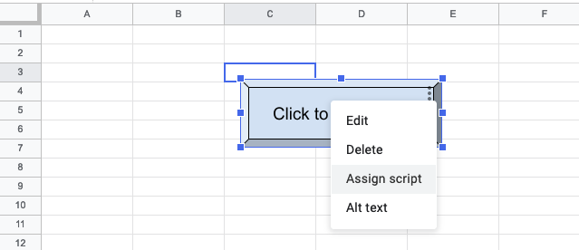
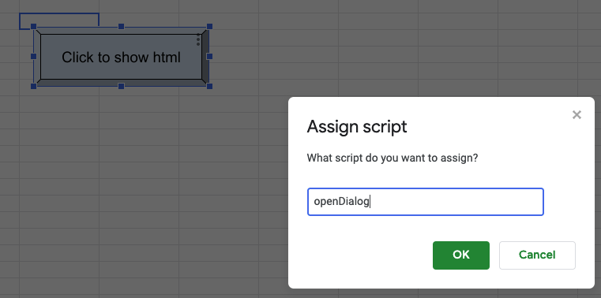
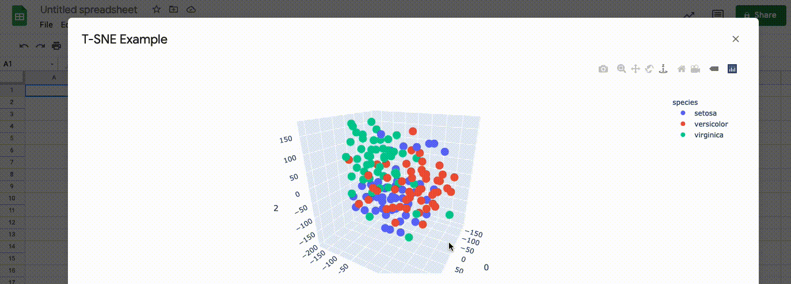
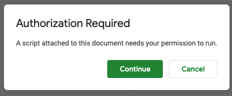

前陣子有人推薦了一個好用的資料呈現套件[plotly](https://plotly.com/)，這個套件可以將結果輸出成html讓使用者與之互動，這邊紀錄一下如何將html呈現在Google Sheet裡面，讓我們不用再找一個地方存放這個html。

<!--more-->

具體實現的方法是建立一個Google Apps Script，並綁定Google Sheet上面的物件，讓使用者跟這個物件互動的時候跳出一個Dialog擺html來跟使用者互動，底下會詳述各個步驟該如何設定。

## Google Apps Script

首先先打開Google Sheet，並在工具的地方按下Script editor。


按下去以後會跳出新的分頁，在這裡可以寫一些程式碼來去與Google的服務做互動。


在這邊我們將底下的程式碼貼到`Code.gs`的檔案裡面，記得將`<YOUR_HTML_FILENAME>`替換成你html的檔名、想一個要顯示在Dialog的名稱替換掉`<TITLE_OF_DIALOG>`。目前設定跳出來的Dialog的大小是1000*1000，可以根據你想要顯示的大小做調整。

```javascript
function openDialog() { 
  var html = HtmlService.createHtmlOutputFromFile('<YOUR_HTML_FILENAME>') 
    .setSandboxMode(HtmlService.SandboxMode.NATIVE)
    .setHeight(1000)
    .setWidth(1000);; 
  SpreadsheetApp.getUi() 
    .showModalDialog(html, '<TITLE_OF_DIALOG>'); 
}
```

最後在檔案旁邊的`+`號點選新增html，並將你想要呈現的html貼在裡面並按下旁邊的`Save project`就完成這個部分了。




記得新增的html名稱要跟程式碼裡面寫的一致。

## 綁定Google Sheet物件

首先，我們要先創建一個物件讓使用者跟它做互動，這邊我們自己畫一個像按鈕的圖樣。




建立好物件後，點選右上角的三個點，選擇`Assign script`。



在跳出的視窗填上剛剛程式碼中的function名稱`openDialog`後按下OK。



到這邊就全部設定完成了！之後使用者點選物件就會跳出你製作的html。



值得一提的是，在使用者第一次點選的時候，應該會跳出像底下的權限要求，照著提示准許就行。



如果之後想要移動物件位置的話，對物件按滑鼠右鍵即可。

## 參考資料

1. [How do I add HTML code in a Google Spredsheet Cell](https://www.quora.com/How-do-I-add-HTML-code-in-a-Google-Spreadsheet-Cell)

