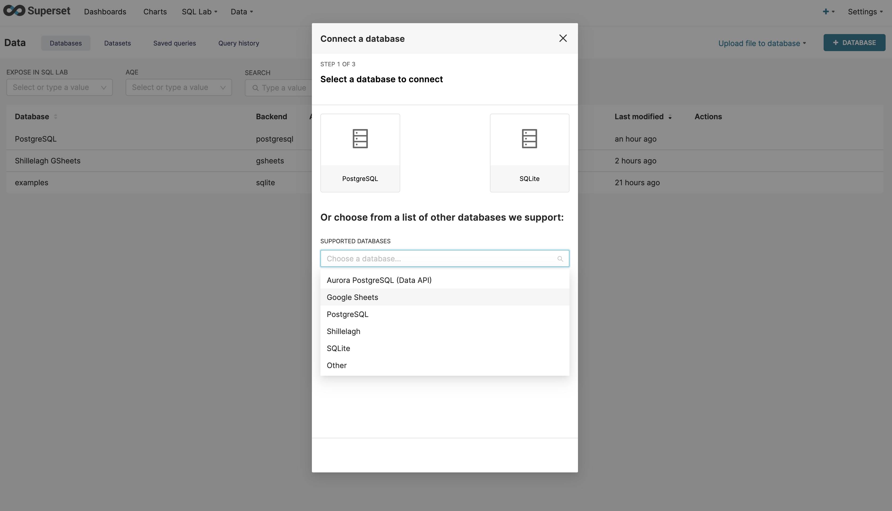
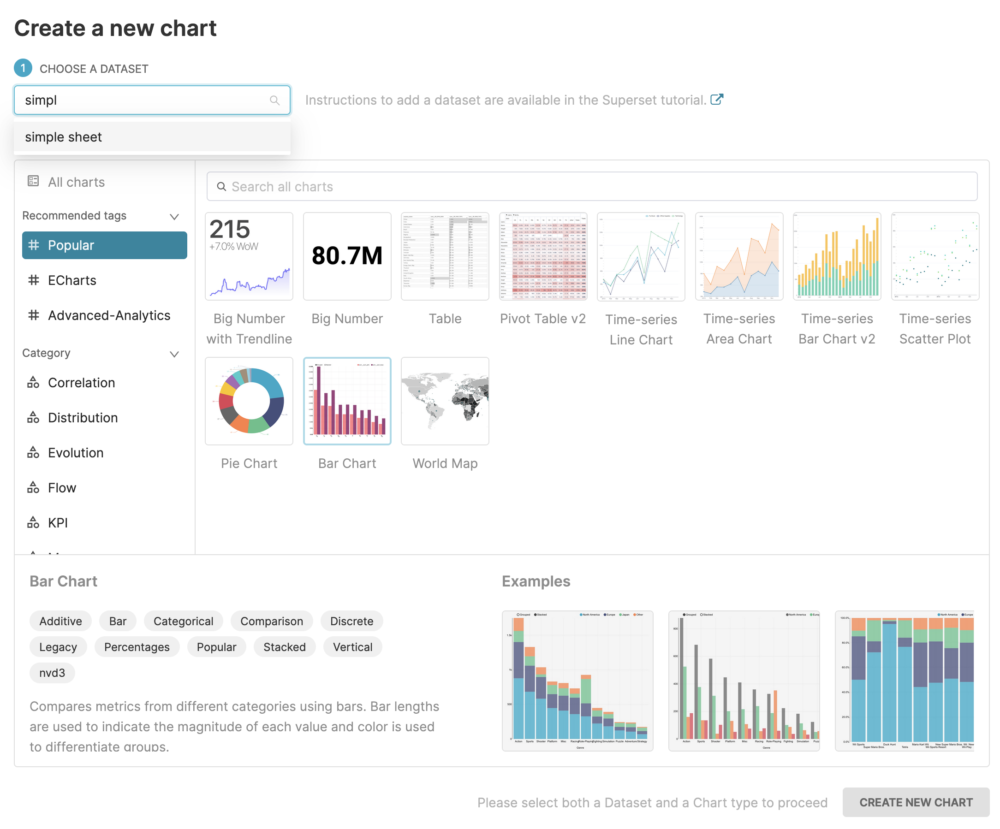
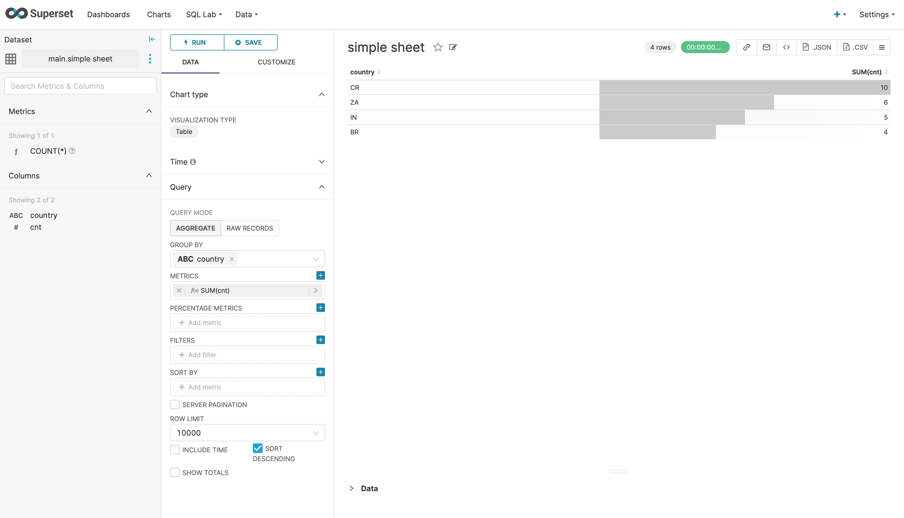
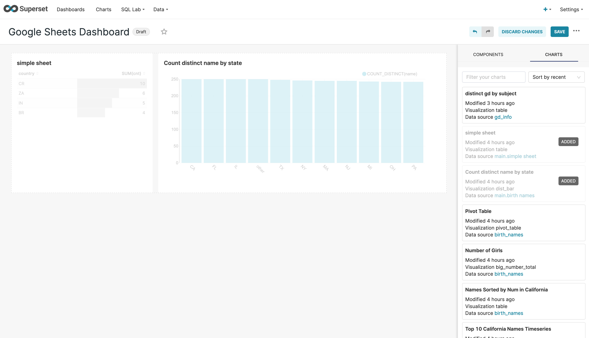
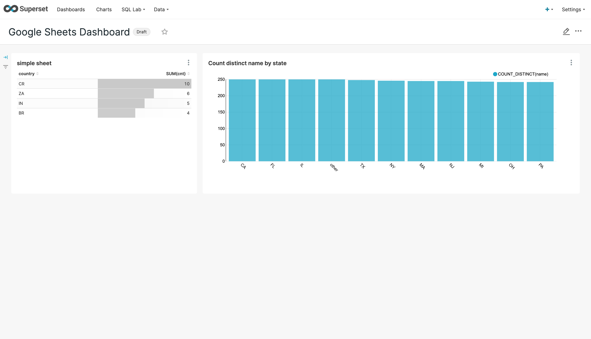

這篇文章簡單記錄一下如何安裝superset並從Google Sheets和CSV當中匯入資料做成dashboard。

<!--more-->

## Superset簡介

Superset是個最早由Airbnb開發，後來開源到Apache的businese intelligence工具，讓使用者可以方便地視覺化資料庫裡面的資料，而這邊的資料庫除了常見的PostgreSQL、Hive以外，還支援從Google Sheets和使用者上傳的CSV來當作資料的源頭。

## 安裝Superset

這邊放上我安裝時使用的指令，其他的安裝方法或詳細的介紹可以參考[官方的安裝文件](https://superset.apache.org/docs/installation/installing-superset-from-scratch)。

```bash
sudo yum install -y gcc gcc-c++ libffi-devel python-devel python-pip python-wheel openssl-devel cyrus-sasl-devel openldap-devel bzip2-devel xz-devel
pip3 install --upgrade pip
pip3 install apache-superset MarkupSafe==2.0.1
# Recompile python if is shows python cannot import bz2

export FLASK_APP=superset
superset db upgrade

# Create default roles and permissions
superset init

# Create an admin user in your metadata database (use `admin` as username to be able to load the examples)
superset fab create-admin

# Load some data to play with
superset load_examples

# To start a development web server on port 8088, use -p to bind to another port
superset run -p 8088 --with-threads --reload --debugger
```

在上面的指令中，我們有建立了一個admin帳號，其帳號密碼都是`admin`，並在最後一行的指令啟動了superset，這時理論上連到`localhost:8088`就能看到superset的UI了。

另一個快速使用superset的方法是[透過docker-compose來安裝](https://superset.apache.org/docs/installation/installing-superset-using-docker-compose)，在安裝好docker和docker-compose以後執行底下的指令就可以了。

```bash
git clone https://github.com/apache/superset.git
cd superset
docker-compose -f docker-compose-non-dev.yml pull
docker-compose -f docker-compose-non-dev.yml up
```

我個人在嘗試的時候使用上面的指令安裝不起來，需要回到2.1.0的版本才能成功，如果想要從latest回到2.1.0，需要先下`docker volume`把跟superset有關的volume先刪除掉，並修改**docker-compose-non-dev.yml**中docker image的tag，把latest改成2.1.0。

```yml
x-superset-image: &superset-image apache/superset:2.1.0
```

最後checkout到2.1.0並執行底下的指令。

```bash
git checkout 2.1.0
TAG=2.1.0 docker-compose -f docker-compose-non-dev.yml pull
TAG=2.1.0 docker-compose -f docker-compose-non-dev.yml up
```

## 製作Dashboard流程

在superset裡面要製作最後的dashboard前有幾個步驟需要先執行：

1. 建立Database：與database建立連線，讓superset能從database裡面撈取資料出來。

2. 建立Dataset：從database裡面引入table，在database裡面可能有千千萬萬個table，這邊我們需要告訴superset我們有興趣的table是哪些，只把有興趣的table schema引入到superset裡面。

3. 製作chart：引入了table以後，就能寫SQL或是用預先定義好的metric（$SUM(\star)$、$COUNT(\star)$）來視覺化table的資訊。

4. 製作dashboard：把前一個步驟製作的chart的呈現在一個dashboard中，方便一次瀏覽多個table視覺化的結果。

## 建立Database

底下介紹如何使用連結Google Sheets和PostgreSQL這兩個database，如果想要連結其他database的話，可以參考[官方文件](https://superset.apache.org/docs/databases/installing-database-drivers)。由於superset主要是由python所編寫的，為了要能跟database做連線，我們需要安裝相關database的python API，在文件裡面有建議要安裝哪些套件。

### Google Sheets

#### 安裝driver

因為在 前面是透過`pip3 install`來安裝superset的，所以在這邊也只需要簡單的安裝pip package就能讓superset使用了，不過有可能會需要重新啟動superset來讓它吃到最新的API。

```bash
pip3 install shillelagh
```

#### 引入database

在安裝好Google Sheets driver以後，在superset的UI上面點選`Data>Databases`，在右邊可以看到新增Database的按鈕，點下去以後理論上就能看到`Google Sheets`的選項了。



在下一個畫面當中只要填上相對應的名稱和網址就能順利建立了，需要注意的是Google Sheets的權限必須要設定成所有人都能觀看才能引入，如果想要讓私人的Google Sheets能被superset讀取的話，可以參考[這篇文章](https://docs.preset.io/docs/google-sheets-private-connection)，另外Google Sheets裡面每一個不同的tab都需要手動新增進來，假如說我們想要引入這個sheets裡面的`Simple sheet`、`2 header sheet`和`birth_names`的話，就會需要填寫以下的設定。

```bash
Name: simple sheet
URL: https://docs.google.com/spreadsheets/d/1_rN3lm0R_bU3NemO0s9pbFkY5LQPcuy1pscv8ZXPtg8/edit#gid=0

Name: 2 header sheet
URL: https://docs.google.com/spreadsheets/d/1_rN3lm0R_bU3NemO0s9pbFkY5LQPcuy1pscv8ZXPtg8/edit#gid=1077884006

Name: birth names
URL: https://docs.google.com/spreadsheets/d/1_rN3lm0R_bU3NemO0s9pbFkY5LQPcuy1pscv8ZXPtg8/edit#gid=174770703
```

### PostgreSQL

#### 安裝PostgreSQL

安裝PostgreSQL的方式在不同的OS上不太一樣，這邊貼上我安裝時使用的指令。

```bash
sudo yum install -y https://download.postgresql.org/pub/repos/yum/reporpms/EL-7-x86_64/pgdg-redhat-repo-latest.noarch.rpm
sudo yum install -y postgresql14-server
sudo /usr/pgsql-14/bin/postgresql-14-setup initdb
sudo systemctl enable postgresql-14
sudo systemctl start postgresql-14
```

安裝好PostgreSQL以後，我們需要在其中建立使用者帳號，可以參考底下的指令，記得將`USER_NAME`替換成自己的帳號名稱。

```bash
sudo -i -u postgres
createuser USER_NAME
createdb USER_NAME
```

如果順利的話，理論上在自己帳號底下執行`psql`應該就能進入PostgreSQL的介面了，這時我們需要幫這個帳號設定一個密碼方便superset來登入。

```bash
# In psql command line
alter user USER_NAME password 'PASSWORD';
```

#### 安裝driver

```bash
pip3 install psycopg2-binary
```

#### 引入database

安裝好driver以後，在按下新增database的按鈕時，應該就能看到PostgreSQL的選項了，這邊貼上預設的設定，理論上把`USER_NAME`、`PASSWORD`替換成自行設定的值後按下connect就可以了。


如果希望讓superset支援CSV上傳的功能，需要在`ADVANCED`的設定中的`Security`裡面勾選`Allow data upload`的選項，上傳的CSV會在PostgreSQL裡面建立一張新的table。

## 建立Dataset

在成功引入database以後，在`Data>Datasets`裡面按下新增Dataset的按鈕，選擇好database就能看到前面引入的database裡面的table們了，點選`ADD`以後就能在chart裡面讀取這些table的資料。


## 製作Chart

成功引入dataset以後，在create chart的部分就能找到先前引入的dataset了，接著就能根據想看的資訊來做出漂亮的圖表。





## 製作Dashboard

在把table的資訊視覺化成chart以後，如果想要將多個chart顯示在同一個畫面可以使用dashboard，在建立dashboard的畫面裡面可以用拖曳的方式來把想要顯示的chart放進來。

  

最後按下Save就大功告成了。


