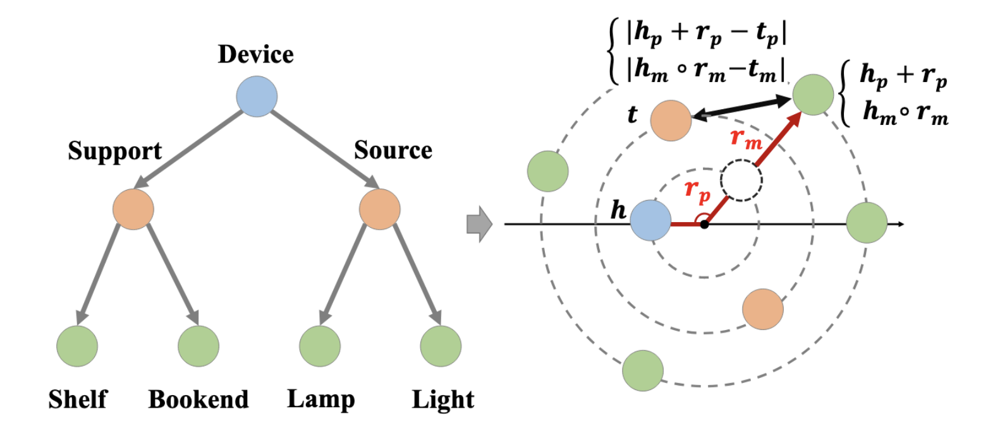

簡單記錄一下看完這篇paper的筆記。

<!--more-->

[這篇paper](https://arxiv.org/abs/1911.09419)是AAAI 2020中被發表的paper，相較於其他knowledge graph的paper，這篇paper把所有的entity都放進極座標當中，希望讓模型學習到越內層的entity是階層中比較高的，越外層的eneity是階層中比較低的。

## Hierarchy-Aware Knowledge Graph Embedding (HAKE)



### Annotation

在輸入給模型的資料當中，主要會是各個entity之間的relation，寫作`(head, relation, tail)`，指得是說`head`和`tail`之間有`relation`，而`head`是比較上層的，以上面圖片中的例子來說，可能的資料會是

```json
(Device, has_function, Source)
(Device, has_function, Support)
(Source, has_object, Lamp)
(Source, has_object, Light)
...
```

在paper裡面我們會給每一個`head`、`relation`和`tail`各一個embedding，分別寫作$\mathbf{h}$、$\mathbf{r}$和$\mathbf{t}$，其中因為作者想要將embedding存在在極座標當中，所以每一個embedding都會存在有modulus和phase的這兩個部分，以head的embedding為例，他們分別會被寫作$\mathbf{h}_m$、$\mathbf{h}_p$。

### Modulus Distance

在計算兩個embedding相似性的時候，會把modulus和phase這兩個部分拆開來看，我們會希望$\mathbf{h}_m$在經過relation的轉換以後，越像$\mathbf{t}_m$越好，亦即

$$\mathbf{h}_m \circ \mathbf{r}_m = \mathbf{t}_m$$

而距離的部分就是看實際上跟預期的落差有多少

$$d_{r,m}(\mathbf{h}_m, \mathbf{t}_m)=\left\| \mathbf{h}_m\circ\mathbf{r}_m-\mathbf{t}_m\right\|_2$$

其中值得一提的是，雖然embedding本身可以有負值，但$\mathbf{r}_m$的部分會限制裡面所有的值都必須要大於零，原因是因為我們想要階層比較高的entity在接近原點的位置，由於$[\mathbf{r}_m]_i>0$的特性，模型漸漸地就會將階層低的embedding往外推了。

### Phase Distance

在phase的部分跟modulus差不多，我們希望$\mathbf{h}_p$在經過relation的轉換以後，越像$\mathbf{t}_p$越好

$$(\mathbf{h}_p+\mathbf{r}_p)\mod 2\pi=\mathbf{t}_p,\ where\ \mathbf{h}_p,\mathbf{r}_p,\mathbf{t}_p\in[0,2\pi)^k$$

距離上也是看兩者相差多少

$$d_{r,p}(\mathbf{h}_p, \mathbf{t}_p)=\left\| \sin((\mathbf{h}_p+\mathbf{r}_p-\mathbf{t}_p)/2)\right\|_1$$

### Loss Function

上面分別定義了modulus distance和phase distance，兩個entity實際的距離便可定義成

$$d_r(\mathbf{h},\mathbf{t})=d_{r,m}(\mathbf{h}_m,\mathbf{t}_m)+\lambda d_{r,p}(\mathbf{h}_p,\mathbf{t}_p)$$

其中的$\lambda$是由model自行學出的參數（$\lambda\in\mathbb{R}$），而loss function便是用self-adversarial的loss，希望positive sample的距離要小於$\gamma$，negative sample的距離要大於$\gamma$

$$L=-\log\sigma(\gamma-d_r(\mathbf{h},\mathbf{t}))-\sum\limits^{n}\limits_{i=1}p(h'_i,r,t'_i)\log\sigma(d_r(\mathbf{h}'_i,\mathbf{t}'_i)-\gamma)$$

$$p(h'_j,r,y'_j\vert\left\{(h_i,r_i,t_i)\right\})=\frac{\exp\alpha f_r(\mathbf{h}'_j,\mathbf{t}'_j)}{\sum_i\exp\alpha f_r(\mathbf{h}'_i,\mathbf{t}'_i)},\ where\ \alpha\ is\ temperature$$

$$f_r(\mathbf{h},\mathbf{t})=-d_r(\mathbf{h},\mathbf{t})=-d_{r,m}(\mathbf{h},\mathbf{t})-\lambda d_{r,p}(\mathbf{h},\mathbf{t})$$

## Experiments

作者把這個HAKE模型使用在底下三個dataset上，它們的一些數據放在底下的表格中。


上面是與其他模型在這三個dataset上的比較，可以看到HAKE的表現不俗。
