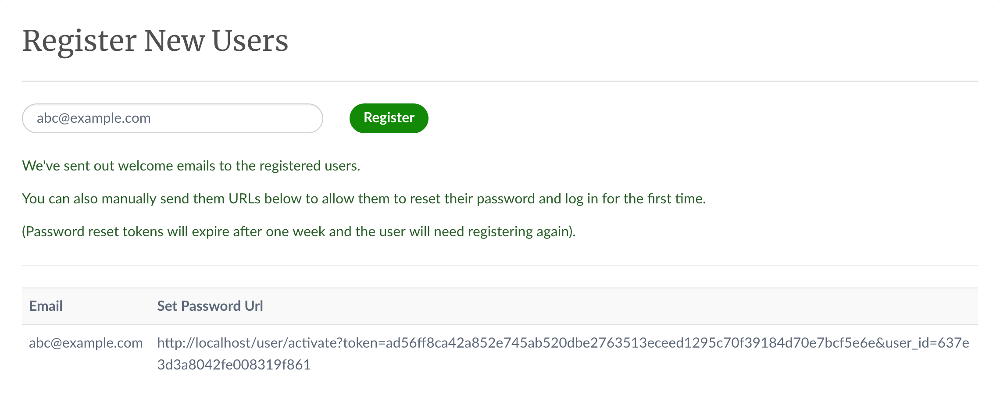

在過去寫paper的時候通常都是使用[overleaf](https://www.overleaf.com/)來跟大家共同協作並把latex編譯成PDF，在偶然的機會發現到原來overleaf是有開源的版本的，底下介紹一下如何自行建立overleaf的伺服器。

<!--more-->

## Overleaf介紹

Overleaf是一個線上latex的共同編輯器，提供了一個平台可以讓大家在上面共同編輯latex的文件，與此同時也支援實時編譯和瀏覽結果，適合個人或者團隊在製作paper、投影片或正式文件的時候使用。

在[overleaf](https://www.overleaf.com/)裡面除了有上述功能以外，還額外整合了git來做版本控制，也能直接在語句中留言，而開源版本的overleaf只有比較基本的共同編輯和實時編譯的功能。

## 建置Overleaf伺服器

詳細的說明可以參考[開源版本overleaf的GitHub](https://github.com/overleaf/overleaf)。

### 設置Overleaf

在建立伺服器之前，我們需要先對它進行一些設定，像是要使用哪個port和IP，底下的指令會把overleaf相關的程式碼下載下來，並產生一些預設的設定檔。

```bash
git clone https://github.com/overleaf/toolkit.git ./overleaf-toolkit
cd ./overleaf-toolkit
./bin/init
```

執行完上面的指令以後，會在當前的目錄下建立`./config/`的資料夾，其中我們比較需要常去修改的是**./config/overleaf.rc**，在裡面就能去調整伺服器的IP和port了。預設的IP是`127.0.0.1`，如果想要讓別人可以存取的話，記得把設定改成`SHARELATEX_LISTEN_IP=0.0.0.0`或是其他想要的IP。

### 透過Docker建立伺服器

在檔案裡面把參數設定好以後，我們就能開始建立伺服器了。overleaf有提供docker image讓大家直接使用，但會需要先安裝docker和docker-compose，docker-compose可以直接透過pip來安裝。

```bash
pip3 install docker-compose
```

接著就能執行底下的指令把伺服器起起來了。

```bash
./bin/up
```

如果想要把伺服器停掉，可以直接用`Ctrl+C`停掉，而停掉後想要繼續的話可以用start的指令。

```bash
./bin/start
```

### 建立Admin帳號

伺服器起來以後需要先建立一個admin帳號，方便之後把其他人加進來一同協作，建立admin的方法是使用瀏覽器直接連線到[http://localhost/launchpad](http://localhost/launchpad)，照著提示輸入email和密碼就行了，記得要將網址裡面的`localhost`改成你設定的IP和port。

## 開始使用Overleaf

把伺服器開起來並有了admin帳號以後，就能開始使用overleaf來編寫簡單的latex文件了，但如果要在latex裡使用一些`\usepackage{}`的時候會發現這些package沒有被安裝，原因是因為overleaf提供的docker image只包含了最基本的套件而已，目的是不想要docker image太大以減少下載image需要的時間，如果想要用`\usepackage{}`的話，我們可以自己更新textlive。

### 更新textlive

詳細的說明可以參考[這邊的文件](https://github.com/overleaf/toolkit/blob/master/doc/ce-upgrading-texlive.md)。

首先，我們需要先連進overleaf的container中

```bash
./bin/shell
```

接著就能透過`tlmgr`來安裝想要的套件了，`tlmgr`的使用方式可以下`tlmgr help`來看說明文件

```bash
# The following command is executed in the container
# tlmgr install PACKAGE_YOU_WANT_TO_USE
tlmgr install tikzlings tikzmarmots tikzducks
```

如果說不想要一個一個把需要的套件安裝進去，想一次安裝全部的話，可以使用底下的指令

```bash
# The following command is executed in the container
tlmgr install scheme-full
```

在安裝完套件以後，理論上就能在伺服器上使用豐富的package了，但這些package在下次重新建立container的時候會消失，如果我們想要保留這個有豐富套件的container，我們可以透過`docker commit`的方式來保存。

首先，我們先透過`exit`或`Ctrl+D`來離開container，接著下底下的指令來儲存一個commit

```bash
docker commit sharelatex sharelatex/sharelatex:with-texlive-full
```

然後在`./config/`底下建立一個**docker-compose.override.yml**的檔案，在其中貼上底下的內容

```yaml
---
version: '2.2'
services:
    sharelatex:
        image: sharelatex/sharelatex:with-texlive-full
```

最後再執行底下的指令來重新建立container。

```bash
bin/stop && bin/docker-compose rm -f sharelatex && bin/up
```

### 開帳號與共享

在開完admin帳號並創立好project以後，我們就可以直接透過瀏覽器去幫其他人開帳號並分享project給他們，開帳號的方式是點畫面右上角`Admin`底下的`Manage Users`


在下一個畫面中打上對方的email按下`Register`後，就能產生啟動連結



記得把啟動連結裡面的`localhost`替換成前面設定的IP和port以後傳給對方，對方就能透過連結自行設定密碼來建立帳號。


在project內選擇分享並打上對方的email，對方就能在project列表裡面看到邀請通知，點開就能共同編輯同一個project了。如果是新建立的使用者，會需要先創建一個空白的project以後才能跳轉到project列表中。
