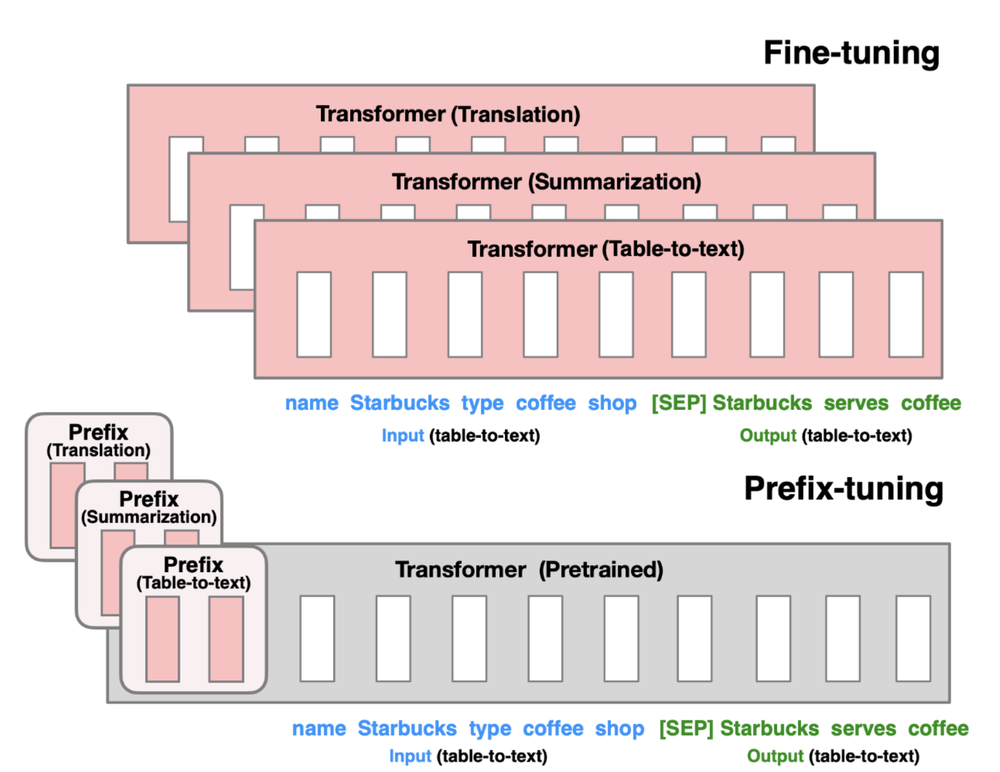

隨著大型語言模型（LLM）的蓬勃發展，各式各樣的應用也隨之而來，但如果想要為自己的應用而fine-tune LLM的話，除了更新整個LLM的參數外，還有很多只訓練少量參數的方法，這篇文章簡單介紹一些有效率調整參數的方法。

<!--more-->

PEFT又或是Parameter-Efficient Fine-Tuning指得便是使用少少的參數來有效率地調整模型，省去調整整個模型的參數來達到fine-tune模型的效果，底下會介紹一些常見的PRFT方法。

## Adapter Tuning

Adapter Tuning的概念是在原本Transformer的架構當中，插入Adapter，並在接下來的訓練裡面只訓練Adapter。

在上圖的左邊是Transformer的架構，主要由Attention layer和Feed-forward layer組成，而在[paper](https://arxiv.org/pdf/1902.00751.pdf)裡面，作者們把Adapter插在Feed-foward layer後面、skip connection之前。Adapter的架構展示在上圖右邊，是一個會先降維再升維的Feed-forward layer們，其中也包含了一個skip connection，讓Adapter最差的效果等同於Identity matrix，維持原本LLM的水準。

## Prefix Tuning

[Prefix Tuning](https://arxiv.org/pdf/2101.00190.pdf)的概念是在把各個不同任務的文字輸入到LLM，轉換成embedding之前，對每個不同的任務多加了一些Prefix，在fine-tune的時候就只訓練這些Prefix。

## Prompt Tuning

這個感覺跟Prefix tuning一樣？

## P-Tuning

## LoRA

## 參考資料

* [让天下没有难Tuning的大模型-PEFT技术简介](https://zhuanlan.zhihu.com/p/618894319)
